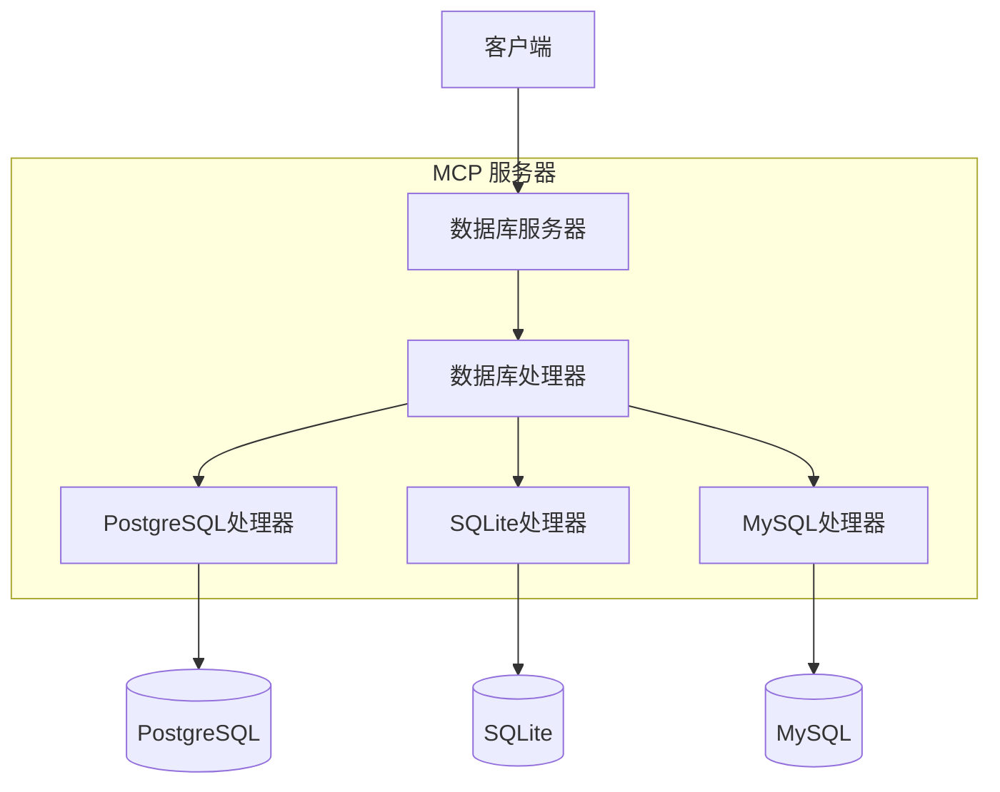

# MCP 数据库工具技术指南

## 架构设计

### 核心概念：抽象层设计



抽象层设计是MCP数据库工具的核心架构概念。就像通用遥控器可以控制不同设备一样，用户只需要了解基本操作，而无需理解底层复杂性。

#### 1. 简化用户交互
- 用户只需知道数据库配置名称（例如"my_postgres"）
- 无需处理连接参数和实现细节
- MCP服务器自动处理数据库连接和查询

#### 2. 统一接口设计
- DatabaseHandler抽象类定义了统一的操作接口
- 所有特定数据库实现（PostgreSQL/SQLite/MySQL）遵循相同的接口
- 用户以相同的方式与不同数据库交互

#### 3. 配置和实现分离
- 复杂的数据库配置参数封装在配置文件中
- 运行时通过简单的数据库名称访问
- 可以轻松管理和修改数据库配置，而不影响业务代码

### 系统组件
1. DatabaseServer
   - MCP服务器的核心组件
   - 处理资源和工具请求
   - 管理数据库连接生命周期

2. DatabaseHandler
   - 定义统一接口的抽象基类
   - 包括get_tables()、get_schema()、execute_query()等方法
   - 由PostgreSQL、SQLite和MySQL处理器实现

3. 配置系统
   - 基于YAML的配置文件
   - 支持多个数据库配置
   - 类型安全的配置验证

4. 错误处理和日志记录
   - 统一的错误处理机制
   - 详细的日志输出
   - 敏感信息掩码处理

## API文档

### DatabaseServer
核心服务器类，提供：
- 资源列表检索
- 工具调用处理（list_tables、query等）
- 数据库处理器管理

### MCP工具

#### dbutils-list-tables
列出指定数据库中的所有表。
- 参数：
  * connection: 数据库连接名称
- 返回：包含表名列表的文本内容

#### dbutils-run-query
在指定数据库上执行SQL查询。
- 参数：
  * connection: 数据库连接名称
  * sql: 要执行的SQL查询（仅SELECT）
- 返回：格式化文本形式的查询结果

#### dbutils-get-stats
获取表统计信息。
- 参数：
  * connection: 数据库连接名称
  * table: 表名
- 返回：包括行数、大小、列统计信息等

#### dbutils-list-constraints
列出表约束（主键、外键等）。
- 参数：
  * connection: 数据库连接名称
  * table: 表名
- 返回：详细的约束信息

#### dbutils-explain-query
获取查询执行计划和成本估算。
- 参数：
  * connection: 数据库连接名称
  * sql: 要解释的SQL查询
- 返回：格式化的执行计划

#### dbutils-get-performance
获取数据库性能统计信息。
- 参数：
  * connection: 数据库连接名称
- 返回：详细的性能统计信息，包括查询时间、查询类型、错误率和资源使用情况

#### dbutils-analyze-query
分析SQL查询的性能并提供优化建议。
- 参数：
  * connection: 数据库连接名称
  * sql: 要分析的SQL查询
- 返回：包含执行计划、时间信息和优化建议的查询分析

### DatabaseHandler
定义接口的抽象基类：
- get_tables()：获取表资源列表
- get_schema()：获取表结构
- execute_query()：执行SQL查询
- cleanup()：资源清理

### PostgreSQL实现
提供PostgreSQL特定功能：
- 远程连接支持
- 表描述信息
- 约束查询

### SQLite实现
提供SQLite特定功能：
- 文件路径处理
- URI方案支持
- 密码保护支持（可选）

### MySQL实现
提供MySQL特定功能：
- 远程连接支持
- 字符集配置
- SSL/TLS安全连接
- URL和标准连接方法

## 代码质量

### 质量门禁
我们使用SonarCloud维护高代码质量标准。所有拉取请求必须通过以下质量门禁：

- 代码覆盖率：≥ 80%
- 代码质量：
  * 无阻断或严重问题
  * 主要问题少于10个
  * 代码重复率 < 3%
- 安全性：
  * 无安全漏洞
  * 无安全热点

### 自动化检查
我们的CI/CD流程自动执行：
1. 完整测试套件执行
2. 代码覆盖率分析
3. SonarCloud静态代码分析
4. 质量门禁验证

不满足这些标准的拉取请求将自动被阻止合并。

### 代码风格
我们使用Ruff进行代码风格检查和格式化：

所有代码必须遵循我们的风格指南：
- 行长度：88个字符
- 缩进：4个空格
- 引号：双引号
- 命名：PEP8约定

有关详细指南，请参阅[STYLE_GUIDE.md](STYLE_GUIDE.md)。

### 本地开发
要在本地检查代码质量：
1. 运行带覆盖率的测试：
   ```bash
   pytest --cov=src/mcp_dbutils --cov-report=xml:coverage.xml tests/
   ```
2. 在IDE中使用SonarLint及早发现问题
3. 在PR评论中查看SonarCloud分析结果
4. 运行Ruff进行代码风格检查：
   ```bash
   # 安装Ruff
   uv pip install ruff
   
   # 检查代码风格
   ruff check .
   
   # 格式化代码
   ruff format .
   ```
5. 使用pre-commit钩子进行自动检查：
   ```bash
   # 安装pre-commit
   uv pip install pre-commit
   pre-commit install
   ```

## 配置系统详解

### 数据库配置选项

数据库SSL配置选项：

PostgreSQL SSL配置：
1. 使用URL参数：
   ```
   postgresql://host:port/dbname?sslmode=verify-full&sslcert=/path/to/cert.pem
   ```
2. 使用专用SSL配置部分：
   ```yaml
   ssl:
     mode: verify-full  # SSL验证模式
     cert: /path/to/cert.pem      # 客户端证书
     key: /path/to/key.pem        # 客户端私钥
     root: /path/to/root.crt      # CA证书
   ```

PostgreSQL SSL模式：
- disable: 不使用SSL
- require: 使用SSL但不验证证书
- verify-ca: 验证服务器证书由受信任的CA签名
- verify-full: 验证服务器证书和主机名匹配

MySQL SSL配置：
1. 使用URL参数：
   ```
   mysql://host:port/dbname?ssl-mode=verify_identity&ssl-ca=/path/to/ca.pem
   ```
2. 使用专用SSL配置部分：
   ```yaml
   ssl:
     mode: verify_identity  # SSL验证模式
     ca: /path/to/ca.pem         # CA证书
     cert: /path/to/cert.pem     # 客户端证书
     key: /path/to/key.pem       # 客户端私钥
   ```

MySQL SSL模式：
- disabled: 不使用SSL
- preferred: 如果可用则使用SSL，但允许非加密连接
- required: 始终使用SSL，但不验证服务器证书
- verify_ca: 验证服务器证书由受信任的CA签名
- verify_identity: 验证服务器证书和主机名匹配

SQLite配置选项：
1. 基本配置与路径：
   ```yaml
   type: sqlite
   path: /path/to/db.sqlite
   password: optional_password  # 可选加密
   ```
2. 使用URI参数：
   ```yaml
   type: sqlite
   path: /path/to/db.sqlite?mode=ro&cache=shared
   ```

## 使用示例

### 基本查询
```python
# 通过连接名称访问
async with server.get_handler("my_postgres") as handler:
    # 执行SQL查询
    result = await handler.execute_query("SELECT * FROM users")
```

### 查看表结构
```python
# 获取所有表
tables = await handler.get_tables()

# 获取特定表的架构
schema = await handler.get_schema("users")
```

### 错误处理
```python
try:
    async with server.get_handler("my_connection") as handler:
        result = await handler.execute_query("SELECT * FROM users")
except ValueError as e:
    print(f"配置错误: {e}")
except Exception as e:
    print(f"查询错误: {e}")
```

## 安全注意事项
- 仅支持SELECT查询以保护数据库安全
- 自动掩盖日志中的敏感信息（如密码）
- 在只读事务中执行查询