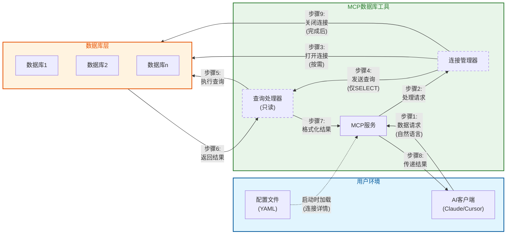

# MCP 数据库工具技术指南

## 通信模式与安全架构

MCP数据库工具服务实现了一套安全的通信模式，旨在每一步都保护您的数据安全。下图展示了数据在各组件之间的流动方式，同时保持安全性：



### 核心安全特性

1. **隔离访问流程**:
   - 您的AI客户端永远不会直接访问您的数据库
   - 所有请求都通过受控的MCP服务环境传递

2. **临时连接**:
   - 仅在需要时才建立数据库连接
   - 查询执行后立即关闭连接
   - 没有可被利用的持久连接

3. **只读操作**:
   - 查询处理器强制执行严格的仅SELECT操作
   - 不可能修改数据（无INSERT、UPDATE、DELETE）

4. **配置分离**:
   - 连接详情隔离在单独的配置文件中
   - 凭据永远不会暴露给AI模型

5. **多数据库支持**:
   - 每个数据库连接单独管理
   - 数据库通过连接管理器相互隔离

这种架构确保即使您将该工具用于多个数据库或用途，每个连接仍然保持安全和隔离，最大限度地减少数据暴露。

## 架构设计

### 核心概念：抽象层设计


抽象层设计是MCP数据库工具的核心架构概念。就像通用遥控器可以控制不同设备一样，用户只需要了解基本操作，而无需理解底层复杂性。

#### 1. 简化用户交互
- 用户只需知道数据库配置名称（例如"my_postgres"）
- 无需处理连接参数和实现细节
- MCP服务器自动处理数据库连接和查询

#### 2. 统一接口设计
- DatabaseHandler抽象类定义了统一的操作接口
- 所有特定数据库实现（PostgreSQL/SQLite/MySQL）遵循相同的接口
- 用户以相同的方式与不同数据库交互

#### 3. 配置和实现分离
- 复杂的数据库配置参数封装在配置文件中
- 运行时通过简单的数据库名称访问
- 可以轻松管理和修改数据库配置，而不影响业务代码

### 系统组件
1. DatabaseServer
   - MCP服务器的核心组件
   - 处理资源和工具请求
   - 管理数据库连接生命周期

2. DatabaseHandler
   - 定义统一接口的抽象基类
   - 包括get_tables()、get_schema()、execute_query()等方法
   - 由PostgreSQL、SQLite和MySQL处理器实现

3. 配置系统
   - 基于YAML的配置文件
   - 支持多个数据库配置
   - 类型安全的配置验证

4. 错误处理和日志记录
   - 统一的错误处理机制
   - 详细的日志输出
   - 敏感信息掩码处理

## API文档

### DatabaseServer
核心服务器类，提供：
- 资源列表检索
- 工具调用处理（list_tables、query等）
- 数据库处理器管理

### MCP工具

#### dbutils-list-tables
列出指定数据库中的所有表。
- 参数：
  * connection: 数据库连接名称
- 返回：包含表名列表的文本内容

#### dbutils-run-query
在指定数据库上执行SQL查询。
- 参数：
  * connection: 数据库连接名称
  * sql: 要执行的SQL查询（仅SELECT）
- 返回：格式化文本形式的查询结果

#### dbutils-get-stats
获取表统计信息。
- 参数：
  * connection: 数据库连接名称
  * table: 表名
- 返回：包括行数、大小、列统计信息等

#### dbutils-list-constraints
列出表约束（主键、外键等）。
- 参数：
  * connection: 数据库连接名称
  * table: 表名
- 返回：详细的约束信息

#### dbutils-explain-query
获取查询执行计划和成本估算。
- 参数：
  * connection: 数据库连接名称
  * sql: 要解释的SQL查询
- 返回：格式化的执行计划

#### dbutils-get-performance
获取数据库性能统计信息。
- 参数：
  * connection: 数据库连接名称
- 返回：详细的性能统计信息，包括查询时间、查询类型、错误率和资源使用情况

#### dbutils-analyze-query
分析SQL查询的性能并提供优化建议。
- 参数：
  * connection: 数据库连接名称
  * sql: 要分析的SQL查询
- 返回：包含执行计划、时间信息和优化建议的查询分析

### DatabaseHandler
定义接口的抽象基类：
- get_tables()：获取表资源列表
- get_schema()：获取表结构
- execute_query()：执行SQL查询
- cleanup()：资源清理

### PostgreSQL实现
提供PostgreSQL特定功能：
- 远程连接支持
- 表描述信息
- 约束查询

### SQLite实现
提供SQLite特定功能：
- 文件路径处理
- URI方案支持
- 密码保护支持（可选）

### MySQL实现
提供MySQL特定功能：
- 远程连接支持
- 字符集配置
- SSL/TLS安全连接
- URL和标准连接方法

## 代码质量

### 质量门禁
我们使用SonarCloud维护高代码质量标准。所有拉取请求必须通过以下质量门禁：

- 代码覆盖率：≥ 80%
- 代码质量：
  * 无阻断或严重问题
  * 主要问题少于10个
  * 代码重复率 < 3%
- 安全性：
  * 无安全漏洞
  * 无安全热点

### 自动化检查
我们的CI/CD流程自动执行：
1. 完整测试套件执行
2. 代码覆盖率分析
3. SonarCloud静态代码分析
4. 质量门禁验证

不满足这些标准的拉取请求将自动被阻止合并。

### 代码风格
我们使用Ruff进行代码风格检查和格式化：

所有代码必须遵循我们的风格指南：
- 行长度：88个字符
- 缩进：4个空格
- 引号：双引号
- 命名：PEP8约定

有关详细指南，请参阅[STYLE_GUIDE.md](STYLE_GUIDE.md)。

### 本地开发
要在本地检查代码质量：
1. 运行带覆盖率的测试：
   ```bash
   pytest --cov=src/mcp_dbutils --cov-report=xml:coverage.xml tests/
   ```
2. 在IDE中使用SonarLint及早发现问题
3. 在PR评论中查看SonarCloud分析结果
4. 运行Ruff进行代码风格检查：
   ```bash
   # 安装Ruff
   uv pip install ruff
   
   # 检查代码风格
   ruff check .
   
   # 格式化代码
   ruff format .
   ```
5. 使用pre-commit钩子进行自动检查：
   ```bash
   # 安装pre-commit
   uv pip install pre-commit
   pre-commit install
   ```

## 配置系统详解

### 数据库配置选项

数据库SSL配置选项：

PostgreSQL SSL配置：
1. 使用URL参数：
   ```
   postgresql://host:port/dbname?sslmode=verify-full&sslcert=/path/to/cert.pem
   ```
2. 使用专用SSL配置部分：
   ```yaml
   ssl:
     mode: verify-full  # SSL验证模式
     cert: /path/to/cert.pem      # 客户端证书
     key: /path/to/key.pem        # 客户端私钥
     root: /path/to/root.crt      # CA证书
   ```

PostgreSQL SSL模式：
- disable: 不使用SSL
- require: 使用SSL但不验证证书
- verify-ca: 验证服务器证书由受信任的CA签名
- verify-full: 验证服务器证书和主机名匹配

MySQL SSL配置：
1. 使用URL参数：
   ```
   mysql://host:port/dbname?ssl-mode=verify_identity&ssl-ca=/path/to/ca.pem
   ```
2. 使用专用SSL配置部分：
   ```yaml
   ssl:
     mode: verify_identity  # SSL验证模式
     ca: /path/to/ca.pem         # CA证书
     cert: /path/to/cert.pem     # 客户端证书
     key: /path/to/key.pem       # 客户端私钥
   ```

MySQL SSL模式：
- disabled: 不使用SSL
- preferred: 如果可用则使用SSL，但允许非加密连接
- required: 始终使用SSL，但不验证服务器证书
- verify_ca: 验证服务器证书由受信任的CA签名
- verify_identity: 验证服务器证书和主机名匹配

SQLite配置选项：
1. 基本配置与路径：
   ```yaml
   type: sqlite
   path: /path/to/db.sqlite
   password: optional_password  # 可选加密
   ```
2. 使用URI参数：
   ```yaml
   type: sqlite
   path: /path/to/db.sqlite?mode=ro&cache=shared
   ```

## 安全注意事项
- 仅支持SELECT查询以保护数据库安全
- 自动掩盖日志中的敏感信息（如密码）
- 在只读事务中执行查询

## 性能优化指南

MCP数据库工具设计为高效运行，但优化您的查询和配置可以显著提高性能和用户体验。

### 高效查询技巧

1. **选择性字段查询**
   - 使用 `SELECT 特定字段` 而不是 `SELECT *`
   - 仅请求您实际需要的列，减少数据传输量

2. **使用适当的WHERE条件**
   - 总是使用WHERE条件限制结果集
   - 针对有索引的列进行过滤以获得最佳性能

3. **结果集大小限制**
   - 对于大型表，始终使用LIMIT子句
   - 考虑分页查询大型结果集：`LIMIT 100 OFFSET 200`

4. **优化JOIN操作**
   - 仅JOIN实际需要的表
   - 优先使用内连接（INNER JOIN）而非外连接（OUTER JOIN）
   - 确保JOIN条件中使用的字段已建立索引

### 配置优化

1. **连接池配置**
   对于高并发环境，您可以调整连接池设置：
   ```yaml
   connections:
     my-postgres:
       # 基本连接信息
       pool:
         min_size: 1      # 最小连接数
         max_size: 5      # 最大连接数
         timeout: 30      # 连接超时（秒）
         recycle: 300     # 连接回收时间（秒）
   ```

2. **超时设置**
   为防止长时间运行的查询占用资源：
   ```yaml
   connections:
     my-postgres:
       # 基本连接信息
       query_timeout: 60  # 查询超时（秒）
   ```

3. **结果大小限制**
   控制返回结果的大小：
   ```yaml
   global:
     max_rows: 5000       # 最大返回行数
     max_text_size: 10000 # 最大文本字段大小（字节）
   ```

### 系统资源考虑

1. **内存使用**
   - 对于大型数据集，考虑增加可用内存
   - 使用查询优化减少内存需求

2. **CPU使用率**
   - 复杂查询（大量JOIN或聚合）需要更多CPU资源
   - 考虑分解复杂查询为多个简单查询

3. **网络带宽**
   - 对于远程数据库，网络延迟可能成为瓶颈
   - 尽量减少大型数据传输，优先在数据库内聚合数据

### 性能监控

使用内置工具监控查询性能：

```
dbutils-explain-query --connection=my-postgres --sql="SELECT * FROM large_table WHERE id > 1000"
```

此工具提供查询执行计划，帮助识别性能瓶颈和改进机会。

```
dbutils-get-performance --connection=my-postgres
```

此工具提供连接的整体性能统计，包括查询时间、缓存命中率和资源使用情况。

## 故障排除指南

在使用MCP数据库工具时，您可能会遇到以下常见问题。以下是排查和解决这些问题的指南。

### 连接问题

1. **无法连接到数据库**
   - 确认您的配置文件中的连接信息是否正确
   - 验证您的数据库服务器是否运行并可访问
   - 检查网络防火墙是否允许连接
   - 对于远程数据库，确认主机名/IP地址和端口是否正确

2. **配置文件错误**
   - 检查YAML语法是否正确（缩进、冒号等）
   - 确认所有必需的字段都已提供
   - 验证文件路径是否正确（特别是SQLite数据库文件）

3. **权限问题**
   - 确保提供的数据库用户具有SELECT权限
   - 检查用户是否可以访问所需的表和视图
   - 对于SQLite，验证文件系统权限是允许读取的

### 工具和查询问题

1. **查询执行失败**
   - 检查SQL语法错误
   - 确认表名和列名拼写正确
   - 验证您的查询仅包含SELECT操作
   - 对于复杂查询，尝试拆分成更简单的部分

2. **性能问题**
   - 避免没有WHERE条件的大表查询
   - 使用LIMIT子句限制结果集大小
   - 对于复杂的JOIN操作，考虑简化查询
   - 使用dbutils-explain-query工具分析查询性能

3. **MCP客户端集成问题**
   - 确认MCP配置正确（命令和参数）
   - 检查路径是绝对路径而非相对路径
   - 验证uvx或docker能在命令行直接运行

### 日志和诊断

对于高级故障排除，您可以启用详细日志记录：

#### 命令行启用调试

```bash
# 启用详细日志
MCP_DEBUG=1 uvx mcp-dbutils --config your_config.yaml
```

#### MCP客户端配置中启用调试

在MCP配置中添加环境变量：

**JSON配置示例**：
```json
{
  "dbutils": {
    "command": "uvx",
    "args": [
      "mcp-dbutils",
      "--config",
      "/path/to/your/config.yaml"
    ],
    "env": {
      "MCP_DEBUG": "1"
    }
  }
}
```

**Cursor MCP配置**：
在Cursor设置 → MCP → 编辑服务器配置中添加环境变量。

日志文件默认位于：
- **Linux/macOS**: `~/.local/share/mcp-dbutils/logs/`
- **Windows**: `%APPDATA%\mcp-dbutils\logs\`

### 常见错误代码

| 错误代码 | 描述 | 可能的解决方案 |
|---------|------|---------------|
| DB001   | 配置文件不存在 | 检查文件路径和权限 |
| DB002   | 配置格式无效 | 检查YAML语法和必需字段 |
| DB003   | 数据库连接失败 | 验证连接参数和网络可达性 |
| DB004   | 查询语法错误 | 检查SQL语法和表名/列名 |
| DB005   | 非SELECT查询 | 移除任何修改数据的操作 |
| DB006   | 权限不足 | 确认用户有足够的权限 |
| DB007   | 查询超时 | 简化查询或增加超时设置 |

如果您遇到未在本指南中列出的问题，请查看我们的[GitHub issues页面](https://github.com/donghao1393/mcp-dbutils/issues)或提交新问题获取支持。

## 版本升级与迁移指南

随着MCP数据库工具的持续改进，定期升级到最新版本可确保您获得最新功能、安全修复和性能改进。本节提供版本升级的最佳实践和版本间迁移的指导。

### 版本命名约定

我们遵循语义化版本（SemVer）规范：

- **主版本**（例如 `2.x.x`）：包含重大变更，可能需要配置调整
- **次版本**（例如 `1.2.x`）：添加了向后兼容的新功能
- **补丁版本**（例如 `1.1.1`）：向后兼容的错误修复和小改进

### 升级前检查清单

在升级之前，请执行以下步骤：

1. **备份配置文件**
   ```bash
   cp your_config.yaml your_config.yaml.bak
   ```

2. **检查当前版本**
   ```bash
   uvx mcp-dbutils --version
   ```
   
3. **查看版本说明**
   - 访问 [GitHub发布页面](https://github.com/donghao1393/mcp-dbutils/releases)
   - 检查新版本与当前版本之间的更改

4. **检查兼容性**
   - 特别注意标记为"破坏性变更"的项目
   - 查看是否需要更新配置文件格式

### 升级步骤

#### 使用uvx的升级（推荐）

```bash
# 升级到最新版本
uvx pip install --upgrade mcp-dbutils

# 或升级到特定版本
uvx pip install --upgrade mcp-dbutils==1.2.0
```

#### Docker镜像升级

```bash
# 拉取最新镜像
docker pull mcp/dbutils:latest

# 或拉取特定版本
docker pull mcp/dbutils:1.2.0
```

#### Smithery升级

```bash
npx -y @smithery/cli update @donghao1393/mcp-dbutils
```

### 主要版本迁移指南

#### 从0.x升级到1.x

**配置文件变更**：
- 连接格式已更改，请参照以下示例更新配置文件
  ```yaml
  # 旧格式 (0.x)
  databases:
    - name: my-db
      type: postgres
      host: localhost
  
  # 新格式 (1.x)
  connections:
    my-db:
      type: postgres
      host: localhost
  ```

**新功能**：
- 添加了连接池支持
- 改进了错误处理和日志记录
- 添加了SSL/TLS配置选项

#### 从1.x升级到2.x（未来）

当主要版本升级可用时，我们将在此处提供详细的迁移指南。

### 版本降级

如果您需要回滚到早期版本：

```bash
# 使用uvx降级
uvx pip install mcp-dbutils==1.0.0

# 或使用特定Docker镜像
docker pull mcp/dbutils:1.0.0
```

### 配置文件转换工具

对于主要版本升级，我们提供配置文件转换工具：

```bash
# 将0.x配置文件转换为1.x格式
uvx mcp-dbutils-convert --input old_config.yaml --output new_config.yaml
```

请在升级后测试服务，确保所有功能按预期工作。如果遇到问题，您可以使用备份的配置文件和降级到先前版本作为临时解决方案。